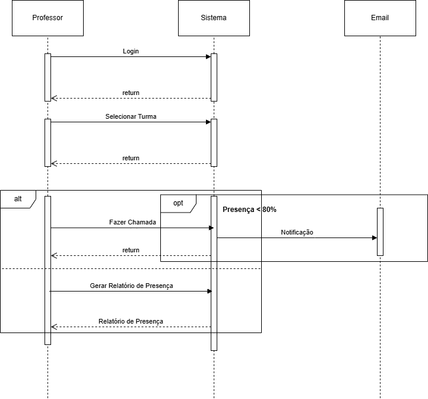
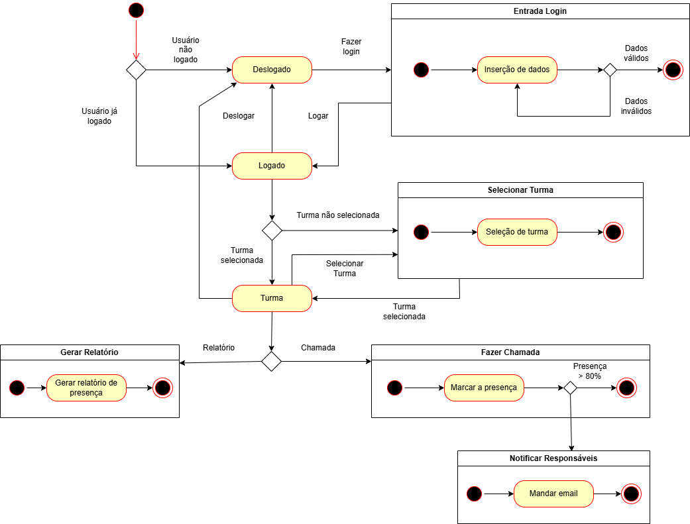
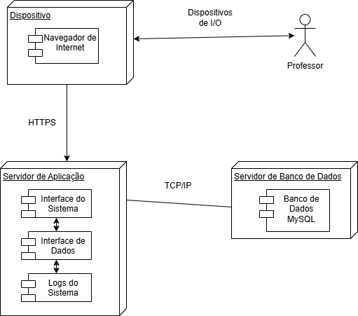

<h2><a href= "https://www.mackenzie.br">Universidade Presbiteriana Mackenzie</a></h2>
<h3><a href= "https://www.mackenzie.br/graduacao/sao-paulo-higienopolis/ciencia-da-computacao">Ciência da Computação</a></h3>

Escola do Infinito

**Conteúdo**

- [Autores](#autores)
- [Descrição do Projeto](#descrição-do-projeto)
- [Análise de Requisitos Funcionais e Não-Funcionais](#análise-de-requisitos-funcionais-e-não-funcionais)
- [Diagrama de Atividades](#diagrama-de-atividades)
- [Diagrama de Casos de Uso](#diagrama-de-casos-de-uso)
- [Descrição dos Casos de Uso](#descrição-dos-casos-de-uso)
- [Diagrama de Sequência](#diagrama-de-sequência)
- [Diagrama de Classes](#diagrama-de-classes)
- [Diagrama de Estados](#diagrama-de-estados)
- [Diagrama de Implantação](#diagrama-de-implantação)
- [Referências](#referências)

# Autores

* Alex Kazuo Kodama
* Gabriel Tortolio Fonseca
* Thomas Pinheiro Grandin

# Descrição do Projeto

Sistema de controle de presença para a Escola do Infinito com emissão de relatórios de faltas e notificações por e-mail.

# Análise de Requisitos Funcionais e Não-Funcionais
**Requisitos Funcionais:**

* Registrar faltas dos alunos
* Gerar relatórios de faltas
* Notificar por e-mail pais ou responsáveis em caso de falta excessiva
* Recursos de acessibilidade
* Autenticação de usuários

**Requisitos Não Funcionais**

* Web-based
* Uso fácil e intuitivo
* Deve estar diponível durante todo o horário de funcionamento da escola
* Conformidade com a LGPD

# Diagrama de Atividades

# Diagrama de Casos de Uso

# Descrição dos Casos de Uso

**Nome do Caso de Uso:** Efetuar Login

**Ator Principal:** Professor

**Resumo:** Descreve as etapas de Login

**Ações do professor:**

2-Insere seu login e senha

4-Professor entra no site

**Ações do Sistema:**

1-Sistema requisita credenciais

3-Verifica se as credenciais são válidas

**Fluxo de Exceção**

Caso as credenciais forem inválidas tentar de novo, até atingir limite de tentativas

**Nome do Caso de Uso:** Selecionar Turma

**Ator Principal:** Professor

**Resumo:** Descreve as etapas de Selecionar a Turma

**Ações do professor:**

1-Seleciona a turma

**Ações do Sistema:**

2-Sistema mostra a turma

**Nome do Caso de Uso:** Fazer Chamada

**Ator Principal:** Professor

**Resumo:** Descreve as etapas de Fazer Chamada

**Ações do professor:**

1-Professor faz a chamada

**Ações do Sistema:**

2-Sistema verifica se a presença está acima de 80%

**Fluxo de Exceção**

Caso aluno esteja com presença abaixo de 80%, notifica os responsáveis

# Diagrama de Sequência

# Diagrama de Classes

# Diagrama de Estados

# Diagrama de Implantação

# Referências

Pressman, R. S., & Maxim, B. R. (2021). Engenharia de software (9th ed.).

SOMMERVILLE, I. Engenharia de software. 10. ed. São Paulo: Pearson Education do Brasil, 2018.
